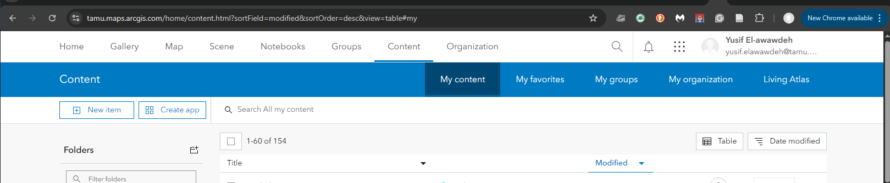
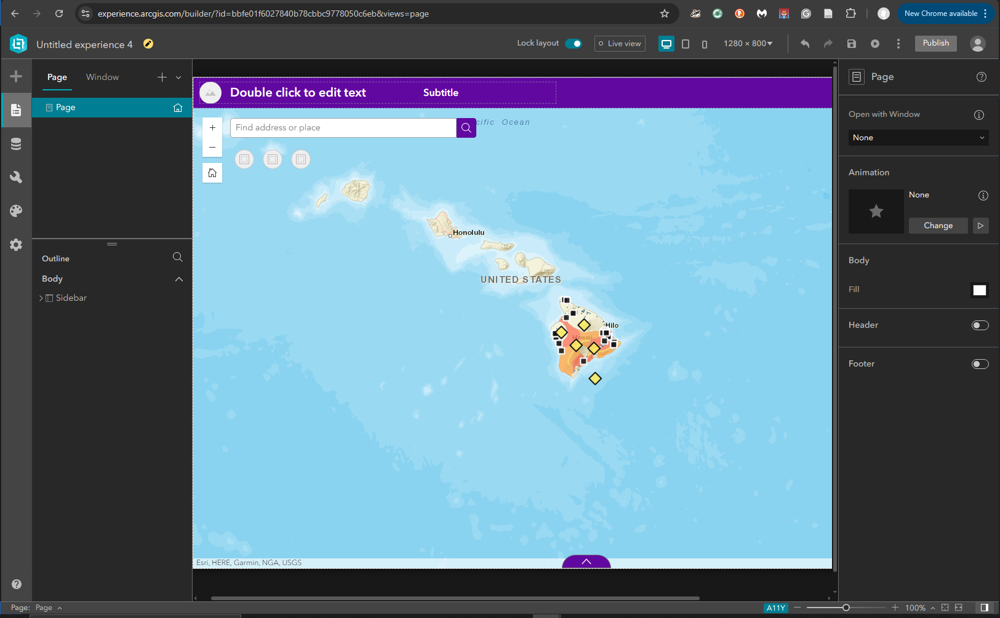

# TAMU WEBGIS: Lab 2

>**Topic:** ArcGIS Online & ArcGIS Experience Builder  
>
# Due Dates and Submission Instructions
>
> **Online Program**: [Online Program Dues Dates & Submission Instructions](https://github.tamu.edu/TAMU-GEOG-678-WebGIS/Online/blob/master/submissions/02.md)  
> 
> **Residential Program**: [Residential Program Dues Dates & Submission Instructions](https://github.tamu.edu/TAMU-GEOG-678-WebGIS/Residential/blob/master/submissions/02.md)

---

# **Tasks:**

1. Finish the ArcGIS Online web map tutorial  
2. Complete the exercise "Create and share a map"  
3. Build a web experience using **ArcGIS Experience Builder**

---

## What is ArcGIS Online?

**ArcGIS Online** is an online, collaborative web GIS that allows you to use, create, and share maps, scenes, apps, layers, analytics, and data. You get access to **Living Atlas of the World**, apps, and ESRI's secure cloud, where you can add items and publish web layers.

## What is Collector for ArcGIS?

Collector for ArcGIS allows you to do many things including collecting and updating data in the field, whether you're online or offline. Collector works on Windows, Android, and iOS and supports external receivers for improved spatial accuracy.

---

## Task 1: ArcGIS Online Web Mapping

Finish the online tutorial [Analyze volcano shelter access in Hawaii](https://learn.arcgis.com/en/projects/analyze-volcano-shelter-access-in-hawaii/html). This tutorial contains two lessons to help you learn how to make maps in ArcGIS Online.  

After you’ve completed this tutorial, you should be able to:  

- Add layers to a map  
- Add data stored in a spreadsheet or other data file to a map  
- Change map symbols  
- Configure pop-ups  
- **Share the map** (in this lab, we will share as an **ArcGIS Experience** instead of an older “Web App”)

### Steps Summary

1. Login to your ArcGIS Online account.  
2. Complete all two lessons of [Analyze volcano shelter access in Hawaii](https://learn.arcgis.com/en/projects/analyze-volcano-shelter-access-in-hawaii/html)..  
3. When it’s time to “share your map as an app,” **choose ArcGIS Experience Builder** instead of a web app template. (See *Task 2* below.)  

> Make sure you open your final Experience link in a private/incognito window or tab to ensure it loads properly without cached credentials.

---

## Task 2: Build an Experience with ArcGIS Experience Builder

Instead of using **Web AppBuilder**, you will now create an interactive experience using **ArcGIS Experience Builder**.

1. **Open ArcGIS Online** and go to **Content**.  

2. Find the **Web Map** you created in Task 1.  

3. Click **Create App** > **Experience Builder** (or, in some interfaces, “Create New” > “Experience”).  

4. Select a **template** (e.g., Launchpad, Pocket, etc.) or start from a **blank** template.

5. Add your Web Map to the Experience by choosing a widget (such as **Map**), and point that widget to your existing Web Map.  

6. Configure styling, layout, and pop-ups according to your preference.  

7. **Save** and **Publish** your Experience.  

**Important**: You can review basic “Getting Started” instructions for Experience Builder here:  

- [What is ArcGIS Experience Builder?](https://doc.arcgis.com/en/experience-builder/latest/get-started/what-is-arcgis-experience-builder.htm)  
- [Esri UC 2021: ArcGIS Experience Builder Introduction (PDF)](https://www.esri.com/content/dam/esrisites/en-us/events/conferences/2021/user-conference/tech-sessions/13038-arcgis-experience-builder-introduction.pdf)

When published, you will have a **URL** that anyone (with proper permissions) can open in a web browser to view your Experience.

---

# **To Hand In:**

1. **Submit the link** to your **ArcGIS Experience** in canvas  
   - Please name your map: “My first Experience – *Your Name*” (for example: `My first Experience – Xiao Li`).  
 

---

# **Grading Rubric**

**ArcGIS Online Web Map & Experience**  

- Color choice (20 pts)  
- Successfully configured pop-ups to show images (40 pts)  
- Successfully published your Experience (10 pts)  

---

<!--
## (Optional) Video Resources
[Video 1 - Lab 2](https://youtu.be/YNnatJyUuTs)
-->

> **Note**: With minimal text changes, all old mentions of Web AppBuilder are replaced by instructions for Experience Builder. If you see references to “app” or “web app” in older tutorials, just know we are using Experience Builder to create the final, published web application.  

---

